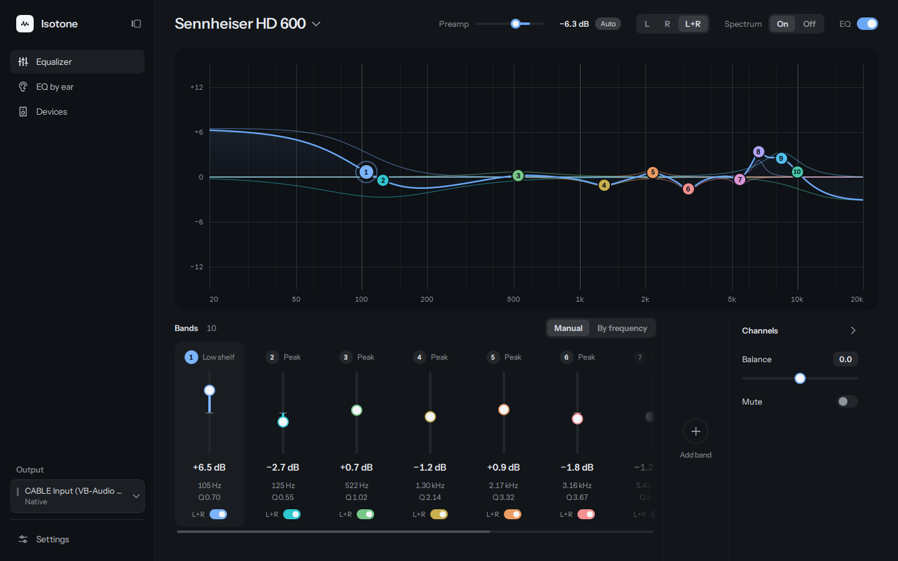

<div align="center">

<picture>
  <source media="(prefers-color-scheme: dark)" srcset="ui/res/isotone.svg">
  
</picture>

# Isotone

System-wide parametric EQ for Windows and Linux.

[](https://github.com/jackwangxyw/Isotone/actions/workflows/ci.yml)
[](https://github.com/jackwangxyw/Isotone/releases)
[](LICENSE)

</div>




A modern system wide parametric EQ software for Windows and Linux. DSP engine built in C++ and UI built using QT.

**Status: 0.1.0, beta.**

## Features

- Parametric bands: peaking, low and high shelf, low and high pass, band pass,
  notch, all pass. Width as Q, bandwidth in octaves, or shelf slope
- A response graph with a live spectrum view
- Per-channel bands, and an L / R view
- Presets per output
- Import of Equalizer APO configs, including GraphicEQ and FilterCurve curves
- Speaker setup on Windows: routing, bass management, delay, polarity, mute,
  balance, etc
- EQ by ear: inspired by DMS's [EQ by ear tool](https://eqbyear.com/)
- Tray icon, global hotkeys, launch at sign-in

## How it works

The DSP core is portable C++20 and is the same on both platforms.

- **Windows**: the core runs inside IsoAPO, an audio processing object forked
  from Equalizer APO. If you already use Equalizer APO, Isotone can use that as its engine through its config files instead.
- **Linux**: the core runs in `isotone-daemon`, a PipeWire filter behind a
  virtual sink. Applications' streams are moved into it when active.

## Install

Downloads are on the [releases page](https://github.com/jackwangxyw/Isotone/releases).

### Windows 10 or later

Run `isotone-0.1.0-setup.exe`. On first run, pick the outputs to equalize.
Installing IsoAPO on an output asks for administrator rights and restarts the
Windows audio service.

### Debian, Ubuntu, Mint

```sh
sudo apt install ./isotone-0.1.0-Linux.deb
```

The daemon is enabled as a systemd user unit and starts at your next sign-in.
Needs PipeWire and WirePlumber.

### Flatpak

```sh
flatpak install --user isotone-0.1.0.flatpak
```

Needs the `org.kde.Platform` 6.11 runtime from Flathub. The Flatpak starts its
own daemon.

## Known limitations

- Linux is stereo only.
- On Linux, Isotone captures every application's stream. This means all applications will route audio through it. You can turn off the EQ for that output, but you can't strictly exclude an output.
  program that does the same, such as EasyEffects. Planned for 0.2.0.
- Global hotkeys on Wayland work only when the app was started from its
  desktop entry or at sign-in, not from a shell.
- KDE and GNOME desktop enviornments were tested in a VM only, so if you find a bug, please report it in Github Issues.

## Building

CMake 3.20 or later and a C++20 compiler (MSVC 2022 or later, GCC 13 or
later). The UI needs Qt 6 (6.4 or later) and is off by default.

```sh
cmake -S . -B build -G Ninja -DISOTONE_BUILD_UI=ON
cmake --build build
ctest --test-dir build
```

The Linux daemon builds when pkg-config finds `libpipewire-0.3`. Packaging:
`windows/setup/isotone.nsi` (NSIS), `cpack -G DEB`, and
`linux/packaging/flatpak/`.

## BUGS!!!

- Isotone is still very much a beta software, so if you find bugs of any kind, please create a github issue so I can fix it.